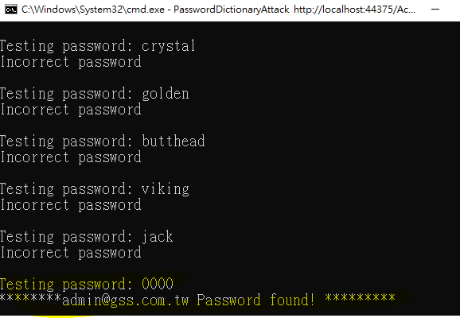

# A2: Broken Authentication

## 目標

>透過 「PasswordDictionaryAttack」 密碼字典攻擊程式，取得登入者的密碼

## 練習步驟

1. 開啟**PasswordDictionaryAttack**專案中的 **Passwords.txt** 檔案，它是密碼字典檔案。程式是檔案中的密碼 Post <http://localhost:44375/Account/Login> 進行登入測試。如果沒有出現 **Incorrect username or password** 表示密碼正確。

2. 在專案**PasswordDictionaryAttack**按右鍵選取「**在檔案總管中開啟資料夾(Open Folder in File Explorer)**」

3. 切換目錄到 bin\Debug ，並在路徑中輸入 cmd ，開啟命令視窗

4. 在命令視窗中輸入

    ```cmd
    PasswordDictionaryAttack http://localhost:44375/Account/Login admin@gss.com.tw
    ```

5. 按下任意鍵，開始測試 admin@gss.com.tw 帳號的密碼

6. 最後可以發現 admin@gss.com.tw 的密碼為 **0000**

    

7. 可重覆 4 ~ 6 ，修改 cmd 內容，將 admin@gss.com.tw 改成其他 Email 帳號，例如 rm@gss.com.tw，

    ```cmd
    PasswordDictionaryAttack http://localhost:44375/Account/Login rm@gss.com.tw
    ```

>密碼字典攻擊防護請參考 todo: Session-5.8

[Back](./../../readme.md)
