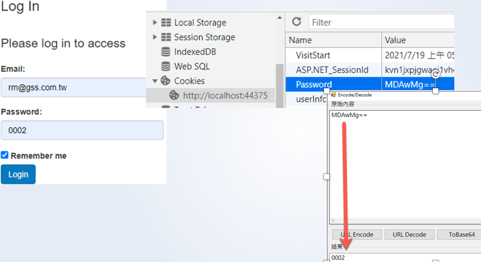
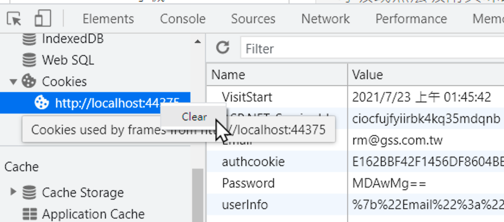

# A3: Sensitive Data Exposure

## 目標

>取得 Cookie 中使用者的密碼

## 練習步驟

1. 開啟 Chrome 在 Url 中輸入 **<http://localhost:44375/Account/Login>**

2. 畫面輸入

    | 欄位 | 值  |
    |---|---|
    | Email | rm@gss.com.tw |
    | Password | 0002 |
    | Remember me | 勾選 |

3. 按下 「**Login**」 Button

4. 在 Chrome 上按右鍵，選取「**檢查**」，在開發者工具中，切到「**Application**」，點選左方 **Cookies** 下的 **<http://localhost:44375>**後，可以發現本網站中有一個 **Password** 的 Cookie。它的值似乎為 Base64 編碼過，透過專案中 **EncodeTools.EXE** 可將它解回成 0002

    

5. 在 Chrome 上按右鍵，選取「**檢查**」，在開發者工具中，切到「**Application**」，在左方 **Cookies** 下的 **<http://localhost:44375>**上，按右鍵，選取 **Clear**，將所有的 Cookies 清空

    

>請試著調整改以FormsAuthenticationTicket Persistent來實作 Remember me

[Back](./../../readme.md)
