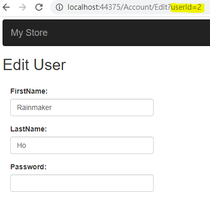
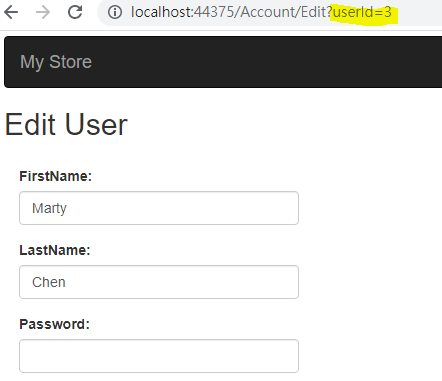

# A5: Broken Access Control

## 目標

>透過修改 QueryString 來取得其他使用者的資訊。

## 練習步驟

1. 開啟 Chrome 在 Url 中輸入 **<http://localhost:44375/Account/Login>**

2. 畫面輸入

    | 欄位 | 值  |
    |---|---|
    | Email | rm@gss.com.tw |
    | Password | 0002 |
    | Remember me | 不勾選 |

3. 按下 「**Login**」 Button

4. 按下 「**Edit**」 Button

5. 可以發現 URL 變成了 **<http://localhost:44375/Account/Edit?userId=2>**，是 rm@gss.com.tw 的個人資訊。

    

6. 修改 URL 中 **userId** 的值，從 2 改成 3 就可以讀取到 Marty 的資料，並加以修改。

    

>修正請參考 todo: Session-7.1, Session-7.2

[Back](./../../readme.md)
