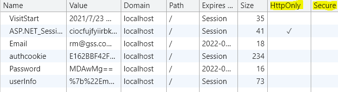
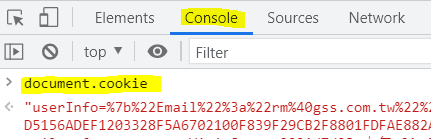

# A6: Security Misconfiguration

## 目標

>透過 JavaScript 取得 Cookies

## 練習步驟

1. 開啟 Chrome 在 Url 中輸入 **<http://localhost:44375/Account/Login>**

2. 畫面輸入

    | 欄位 | 值  |
    |---|---|
    | Email | rm@gss.com.tw |
    | Password | 0002 |
    | Remember me | 不勾選 |

3. 按下 「**Login**」 Button

4. 在 Chrome 上按右鍵，選取「**檢查**」，在開發者工具中，切到「**Application**」，點選左方 **Cookies** 下的 **<http://localhost:44375>** 後，可以發現本網站中大多數的 Cookie **HttpOnly** 及 **Secure** 欄位並未被勾選。

    

5. 一樣在開發者工具中，點選 **Console**，並在 > 後，輸入 **document.cookie** 就可以取得 **HttpOnly** 沒有勾選的 cookie。

    

6. 直接在開發者工具中，將所有 Cookie 的 **HttpOnly** 勾選起來，再到 **Console** ，再次輸入 **document.cookie** ，可以發現，它的值是空字串

>可試著修改 web.config 設定 Cookie 為 HttpOnly

```xml
<httpCookies httpOnlyCookies="true" requireSSL="false" /> 
```

>修改存檔後，請將所有網頁關閉再重新測試
>
>測試沒問題後，請再將再調整回來以利後續範例練習

```xml
<httpCookies httpOnlyCookies="false" requireSSL="false" /> 
```

[Back](./../../readme.md)
