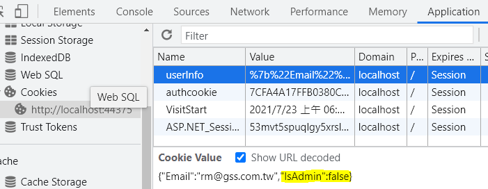

# A8: Insecure Deserialization

## 目標

>透過修改 cookie 中的序列化過的 json 物件，提升使用者的權限

## 練習步驟

1. 開啟 Chrome 在 Url 中輸入 **<http://localhost:44375/Account/Login>**

2. 畫面輸入

    | 欄位 | 值  |
    |---|---|
    | Email | rm@gss.com.tw |
    | Password | 0002 |
    | Remember me | 不勾選 |

3. 按下 「**Login**」 Button

4. 在 Chrome 上按右鍵，選取「**檢查**」，在開發者工具中，切到「**Application**」，點選左方 **Cookies** 下的 **<http://localhost:44375>**後，可以發現本網站中有一個 **userInfo** 的 Cookie。它的值似乎為 URL 編碼過，勾選 **Show URL Decoded** 就可以發現它的值是一個 JSON 的內容

    ```json
    {"Email":"rm@gss.com.tw","IsAdmin":false}
    ```

    

5. 將 **userInfo** Cookie 值 Copy 出來，將 **IsAdmin** 原本的屬性值，由 **false** 改成 **true** ，並貼回 **userInfo** Cookie 值之中。

6. 重新整理頁面，就可以發現，畫面中，多了「**Admin**」的 Button

>修正請參考 todo: Session-8.3

[Back](./../../readme.md)
