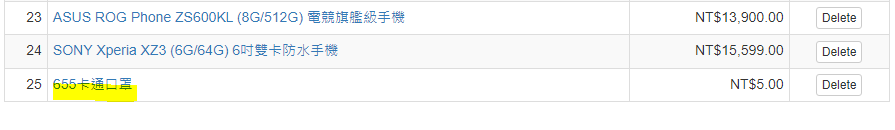
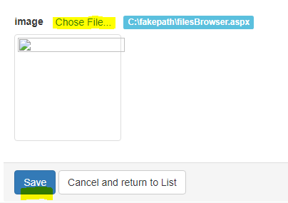
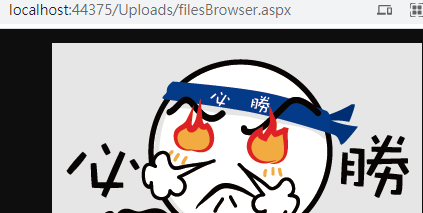
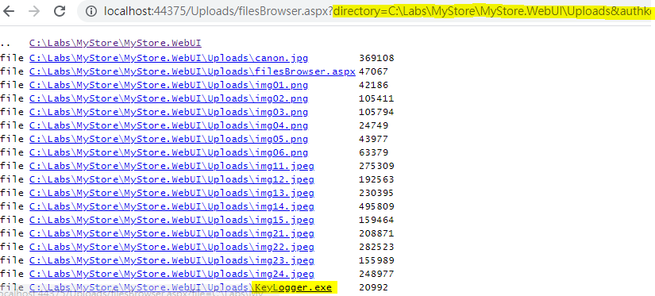

# 透過漏洞來上傳後門程式

## 目標

>很多功能都有**上傳檔案**的功能，而這些功能通常沒有去檢查可允許的檔案格式(png, jpg ...)
>
>本章練習利用這個漏洞，來上傳後門程式

## 練習步驟

1. 承上一練習 [透過漏洞來偷用管理功能](s3.md) 在管理商品功能中，按下「**Add a new product**」 Button。

2. 畫面輸入

    | 欄位 | 值  |
    |---|---|
    |Name|655卡通口罩|
    |Description|卡通口罩|
    |Price|5|
    |Category|Hack|
    |image|點選 **Chose File...** 後，請選取**MyStore\KeyLogger\bin\Debug\KeyLogger.exe**|

3. 按下 「**Save**」 Button

4. 點選 Grid 中 **655卡通口罩** 進入 Edit 畫面

    

5. image 點選 **Chose File...** 後，請選取**Allfiles\filesBrowser.aspx**

    

6. 按下 「**Save**」 Button

7. 點選左上方的 **Hack** 類別

8. 在**655卡通口罩**的圖案上，按右鍵，選取「**在新分頁中開啟圖片**」，URL為 **<http://localhost:44375/Uploads/filesBrowser.aspx>**

    

9. 在URL後加上**?authkey=gss** 按下 Enter。 整個 URL 為 **<http://localhost:44375/Uploads/filesBrowser.aspx?authkey=gss>**。可以發現 filesBrowser.aspx 可以行，知道目前 WebSite 的路徑，及下載任何檔案，例如 web.config 等等。

10. 查看上傳目錄，之前上傳的 **KeyLogger.exe** 也還在上傳的目錄之中(?auhkey=gss&directory=**改Current Path**)。

    

>註: 針對上傳檔案，需要檢查允許的附檔名 (**todo: Session-7.4.n**)，也可以進一步檢查附檔名與檔案內容是否相同，可參考 [FileExtensionValidation](https://github.com/rainmakerho/FileExtensionValidation)。

[Back](./../../readme.md)
