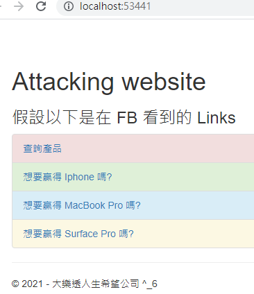
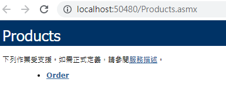
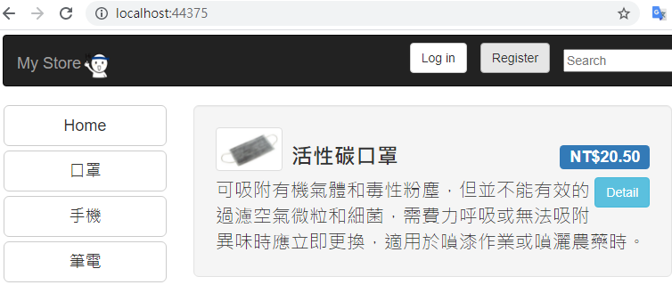

# Lab 啟動設定

1. 開啟檔案總管，在 Lab 目錄，切到安全性 Tab，將目前登入使用者加入，並設定為 **完全控制**

2. 使用 Visual Studio 2017 or Visual Studio 2017 開啟 MyStore.sln

3. 重建方案，確認各專案是否可以正常建置

4. 在專案 **Attacker.MyStore** 按右鍵，檢視(View) -> 在瀏覽器中檢視(View in Browser)

    

5. 在專案 **OrderApp** 中 **Products.asmx** 按右鍵，在瀏覽器中檢視(View in Browser)

    

6. 在專案 **MyStore.WebUI** 按右鍵，檢視(View) -> 在瀏覽器中檢視(View in Browser)

    

註: 如果執行過程中發生「**找不到檔案 … bin\roslyn\csc.exe**」錯誤，請將專案中的 Microsoft.CodeDom.Providers.DotNetCompilerPlatform NuGet 套件解除後，再安裝一次。

[Back](readme.md)
